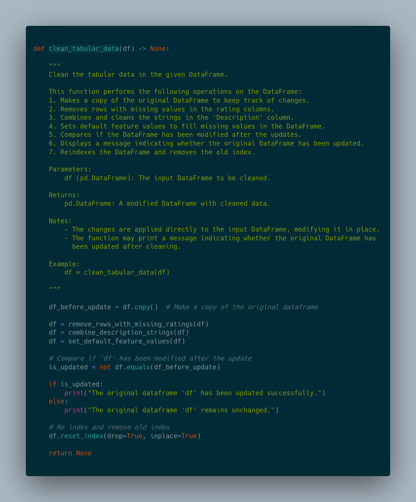
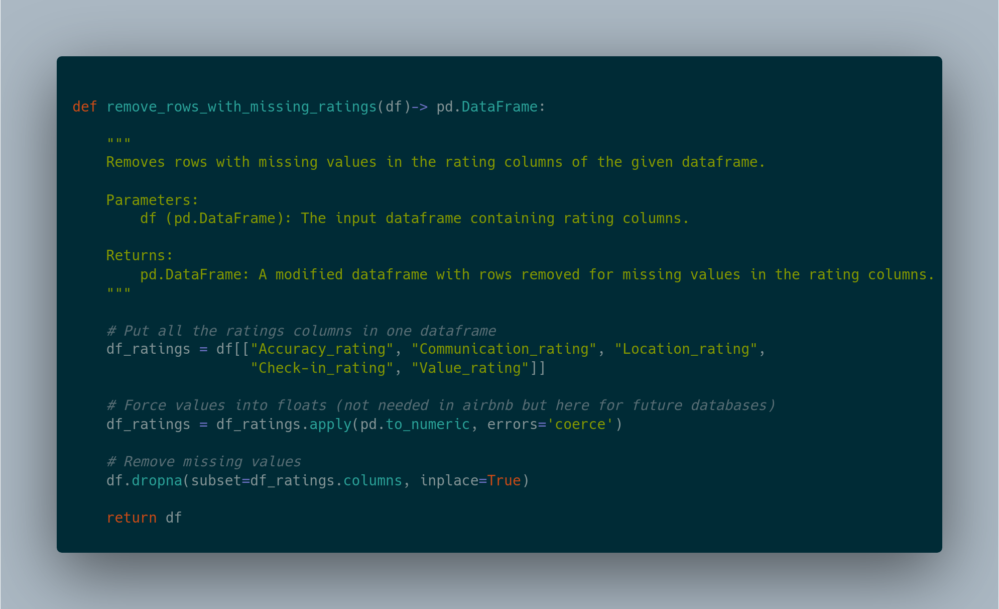

# Badges
[](https://travis-ci.org/Millie-Jackson/airbnb-data-analysis)
[](https://opensource.org/licenses/MIT)
[](https://www.python.org/downloads/)

# AirBnB
Data Science Specialization Project With AiCore
Build a framework to systematically train, tune, and evaluate models on several tasks that are tackled by the Airbnb team

This project involves cleaning and analyzing Airbnb data to gain insights and understand trends in the rental market. 
The dataset used in this project contains various features related to Airbnb listings, such as property details, amenities, ratings, and pricing.


# Table of Contents
1. [Introduction](#introduction)
    - [Problem](#problem)
    - [Solution](#solution)
    - [Target Users](#target-users)
    - [Motivation](#motivation)
2. [Major Features](#major-features)
    - [Data Cleaning](#data-cleaning)
    - [Real-World Learning Exercise](#real-world-learning-exercise)
    - [Customizable Label Column](#customizable-label-column)
    - [Data Saving](#data-saving)
    - [User-Friendly Execution](#user-friendly-execution)
    - [Modular Code Structure](#modular-code-structure)
    - [Real-World Dataset - Airbnb](#real-world-dataset---airbnb)
    - [What Makes this Project Unique](#what-makes-this-project-unique)
3. [Installation](#installation)
4. [Usage](#usage)
5. [Contributing](#contributing)
6. [License](#license)
7. [Technical Breakdown](#technical-breakdown)
    - [Data Loading](#data-loading)
    - [Data Cleaning](#data-cleaning-1)
    - [Save Cleaned Data](#save-cleaned-data)
    - [Label Selection](#label-selection)
    - [Learnings](#learnings)


## Introduction
Airbnb is a popular online marketplace for renting vacation homes, apartments, and lodging. 
The data collected from Airbnb listings can provide valuable information about rental trends, guest preferences, and host performances. 
This project aims to clean the raw Airbnb data, handle missing values, and perform data analysis to extract meaningful insights.
Overall, the project's aim is to empower users with meaningful information and trends in the vacation rental market, making it a valuable resource for various stakeholders interested in the Airbnb industry.

### Problem
The Airbnb Data Cleaning and Analysis Project aims to clean and analyze raw Airbnb data to provide valuable insights and trends in the vacation rental market. 
The dataset contains diverse information related to Airbnb listings, including property details, amenities, guest ratings, and pricing. 
By addressing missing data, handling inconsistencies, and performing data analysis, this project seeks to transform the raw data into a structured and meaningful format.

Specifically, we want to address the following:

- How can we handle missing data and inconsistencies in the raw Airbnb dataset?
- How can we extract meaningful insights and patterns from the cleaned dataset?
- How can we identify trends in the vacation rental market, such as pricing patterns, amenities preferences, and guest ratings?
- How can we provide a user-friendly solution for exploring and visualizing the data?

### Solution
Through the Airbnb Project, users gain access to a cleaned and structured dataset with valuable insights into the vacation rental market. By addressing missing data, performing thorough analysis the project allows property owners, travelers, investors, and data enthusiasts to explore trends, make informed decisions and gain a deeper understanding of the Airbnb market. The user-friendly implementation and data exploration capabilities make the project a valuable resource for anyone interested in the vacation rental market. 

Whether you are looking to optimize your rental offerings, plan your travels, or analyze investment opportunities, this project equips you with the tools to gain actionable insights from Airbnb data.

### Motivation
The Airbnb Data Cleaning and Analysis Project was undertaken as part of the AiCore Data Science Specialization. It served as my first attempt at building a prediction model using neural networks and was a valuable learning exercise utilizing a real-world example.

As part of the data science specialization, the project aimed to enhance my understanding of data cleaning, data analysis, and the application of neural networks for predictive modeling. By working on a real-world dataset like Airbnb data, I could explore the intricacies of handling missing data, extracting insights, and identifying trends in the vacation rental market.

Throughout the project, I gained hands-on experience in data preprocessing, data visualization, and implementing neural networks for regression tasks. The aim was to develop a comprehensive solution that could be applied to other similar datasets and provide meaningful insights to diverse stakeholders in the vacation rental market.

The project's motivation was not only to build a prediction model but also to grasp the practical challenges faced while working with real data. It allowed me to refine my data science skills, learn from iterative improvements, and enhance my overall understanding of the data science workflow.

### Target Users
The target users of this project are individuals or organizations interested in gaining a deeper understanding of the Airbnb rental market. 
Potential users include:

**Property Owners and Hosts:** Hosts looking to optimize their rental offerings by understanding pricing trends, amenities preferences, and guest ratings.

**Travelers and Guests:** Travelers seeking valuable insights into popular locations, amenities availability, and the overall quality of accommodations.

**Real Estate Investors:** Investors exploring potential investment opportunities in the vacation rental market.

**Data Enthusiasts:** Individuals interested in data analysis, visualization, and gaining insights from real-world datasets.

## Major Features
**Data Cleaning:** The project includes a robust data cleaning process to handle missing values, data type conversion, and inconsistency removal. It ensures a clean and reliable dataset for analysis.

**Neural Network Predictive Model:** As a significant feature, the project implements a neural network predictive model for regression tasks. It is my first attempt at building a prediction model using neural networks, providing valuable hands-on experience in machine learning.

**Real-World Learning Exercise:** The project serves as a learning exercise utilizing a real-world example of Airbnb data. It allowed me to grasp practical challenges faced while working with real data and refine data science skills.

**Data Analysis and Visualization:** 

**Customizable Label Column:** The solution offers the flexibility to specify a target label column during analysis. Users can focus on specific aspects of the rental market by customizing the analysis based on their interests.

**Data Saving:** The cleaned data is saved as "clean_tabular_data.csv" to facilitate future analysis and usage.

**User-Friendly Execution:** The project is designed with user-friendliness in mind, providing easy execution of data cleaning and analysis scripts. Individuals with varying programming experience can explore the Airbnb dataset effortlessly.

**Modular Code Structure:** The implementation follows a modular code structure, promoting code reusability and maintainability. Each major feature is encapsulated in separate functions, making it easy to understand and modify the code.

**Real-World Dataset - Airbnb:** The project employs a real-world dataset from Airbnb, ensuring the relevance and practical applicability of the analysis and model building.

### What Makes this Project Unique
The project stands out due to its user-friendly implementation, allowing individuals with varying programming experience to explore the Airbnb dataset effortlessly. The ability to specify a target label column during analysis also provides users with customization options based on their specific interests and requirements.


## Installation
To run the code in this project, you'll need to have Python installed on your system. Additionally, the following Python libraries are required and can be installed using pip:

pandas

numpy

To install the required libraries, use the following command:

```python pip install pandas numpy```


## Usage
Clone the repository to your local machine:

```python git clone https://github.com/Millie-Jackson/airbnb-data-analysis.git```

Navigate to the project directory:

```python cd airbnb```

Run the data cleaning and analysis scripts:

```python python tabular_data.py```


## Contributing
Contributions to this project are welcome! 
If you find any issues or have suggestions for improvement, please feel free to open an issue or submit a pull request.


## License
This project is licensed under the MIT License.


# Technical Breakdown
**Data Loading:** The code starts by loading the raw Airbnb data from a CSV file ("listing.csv") using the pandas library's read_csv function. It handles the case when the file is not found and raises a FileNotFoundError with an appropriate error message.

**Data Cleaning:** The data cleaning process involves removing missing values, converting data types, and handling inconsistencies. 

The tabular_data.py script calls the "clean_tabular_data(df)" function to perform data cleaning. It serves as the core data cleaning process. 

Makes a copy of the original DataFrame ("df_before_update") to track changes.

Calls the remove_rows_with_missing_ratings(df), combine_description_strings(df), and set_default_feature_values(df) functions to clean the data.

Compares if the DataFrame ("df") has been modified after the update and displays a message indicating whether the original DataFrame has been updated.

Reindexes the DataFrame and removes the old index.


The "remove_rows_with_missing_ratings(df)" function is called to rows with missing values in the rating columns (Accuracy_rating, Communication_rating, Location_rating, Check-in_rating, Value_rating).


The "combine_description_strings(df)" function is called to combine and clean the strings in the "Description" column by removing missing descriptions (NaN), the prefix "'About this space'," and empty quotes from the lists in the "Description" column.


The "set_default_feature_values(df)" function is called to set default values for the feature columns (guests, beds, bathrooms, bedrooms) to fill missing values with 1.


**Save Cleaned Data:** After data cleaning, the cleaned DataFrame ("df") is saved as "clean_tabular_data.csv" using the to_csv method of pandas.

**Label Selection:**
The program loads the cleaned data from "clean_tabular_data.csv" using pandas to proceed with further analysis.

The program calls the "load_airbnb(label='Price_Night')" function to load the cleaned data for analysis, with "Price_Night" as the label column.

The "load_airbnb" function checks if the specified label column exists in the data; if not, it raises a "ValueError" with an appropriate error message.

The program then filters out non-numeric columns to include only numerical features in the analysis.


**Data Analysis:**


# Learnings
The Airbnb Data Cleaning and Analysis Project provided a valuable learning experience as it marked several first-time achievements in my data science journey. 

**Pandas:** Working on this project introduced me to the powerful Pandas library in Python. I learned to efficiently manipulate and analyze data using Pandas data structures like DataFrames and Series. The library's functions and methods streamlined data cleaning tasks and enabled smooth data exploration.

**Data Cleaning:** Prior to this project, my data cleaning exercises were limited to tutorials and practice datasets. However, working with the real-world Airbnb dataset presented practical challenges like missing values, data inconsistencies, and diverse data types. I gained hands-on experience in addressing these real data issues, enhancing my data wrangling skills significantly.

The project's focus on data cleaning, data analysis, and building a predictive model with neural networks provided a comprehensive understanding of the data science workflow. It allowed me to apply theoretical knowledge acquired through courses to tackle real-world data complexities.

Throughout the project, I learned the importance of data preprocessing and the impact it has on the quality of analysis and model performance. It provided valuable insights into data-driven decision-making and reinforced the significance of clean, reliable data for accurate predictions.

The project's hands-on nature and the exposure to a real-world dataset offered practical perspectives on data science tasks, laying a strong foundation for future data-driven projects.

## Milestone 1-3
Throughout Milestone 1, 2, and 3, I developed a data science project focused on cleaning the Airbnb data. The project encompasses multiple key functionalities and features.

I have implemented a robust data cleaning process to handle missing values, data type conversion, and inconsistencies in the raw Airbnb dataset. The cleaned dataset ensures the reliability and quality of subsequent analyses. The project allows users to specify a target label column during analysis. This customization option enables users to focus on specific aspects of the rental market based on their interests. The cleaned data is saved as "clean_tabular_data.csv" to facilitate future analysis and usage. This feature ensures the availability of a reliable and cleaned dataset for further tasks. The project is designed with user-friendliness in mind, providing easy execution of data cleaning and analysis scripts. It accommodates users with varying programming experience. To promote code reusability and maintainability, the implementation follows a modular code structure. Each major feature is encapsulated in separate functions, making the code easy to understand and modify.

**Python:** 

I have utilized Python as the primary programming language for this project. Python's versatility, extensive libraries, and strong community support make it an ideal choice for data science tasks. Python's simplicity and readability allow for rapid development and easy debugging. Additionally, its extensive ecosystem of libraries makes it an ideal choice for data science and machine learning tasks.

**Pandas:** 

Pandas is a powerful library in Python for data manipulation and analysis. I have used Pandas to handle data cleaning tasks, data exploration, and data wrangling. Pandas provides intuitive data structures (DataFrames and Series) and powerful tools for data manipulation and future analysis. It simplifies complex data cleaning tasks and enables efficient data exploration.
    
**GitHub:** 

I have utilized GitHub as the version control platform to manage the project's codebase and track changes throughout development. GitHub provides version control and collaborative features, enabling seamless collaboration among team members. Although this aspect hasnt bee used in this solo project it is good to learn these for future projects. It allows me to track changes, manage issues, and maintain a well-organized codebase.
   
**AST:** 

The ast (Abstract Syntax Trees) module in Python has been used to parse Python source code and extract information about the code's abstract syntax structure. The ast module is used to parse complex strings in the "Description" column during data cleaning. By utilizing the abstract syntax trees, we can handle intricate structures and perform data transformations effectively.
